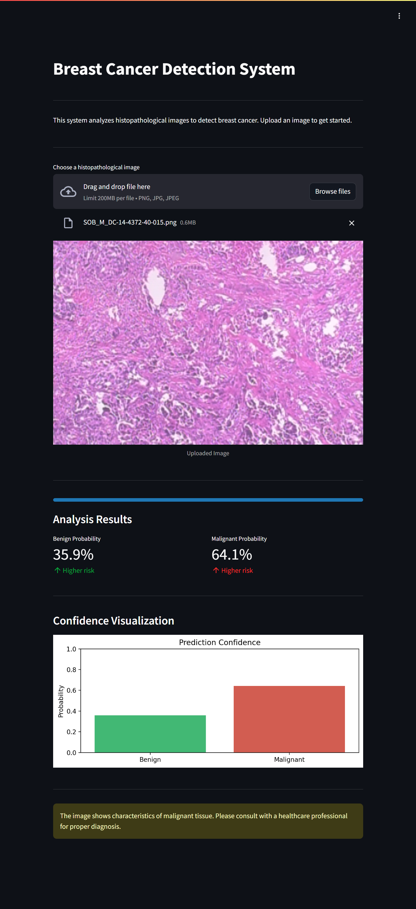

# Breast Cancer Detection Using Deep Learning



## Project Overview

The Breast Cancer Detection project is a deep learning-powered application that identifies malignant and benign tumors from histopathological images. Using a sophisticated deep learning model based on DenseNet201 architecture, it provides accurate classification of breast cancer images.

The application analyzes various visual features through advanced computer vision techniques to identify cancer patterns in histopathological images, providing a comprehensive analysis with confidence scores.

### Classification Categories

| Category | Description |
|----------|-------------|
| Benign   | Non-cancerous tissue patterns |
| Malignant| Cancerous tissue patterns |

### Feature Analysis

The system analyzes images using DenseNet201 architecture with the following key components:

1. **Image Preprocessing**
   - RGB normalization
   - Size standardization (224x224)
   - Pixel value scaling

2. **DenseNet201 Features**
   - Deep convolutional layers
   - Dense connections
   - Global average pooling
   - Batch normalization

3. **Custom Classification Layer**
   - Dropout for regularization
   - Softmax activation
   - Binary classification output

## Table of Contents

1. [Dataset](#dataset)
2. [Model Architecture](#model-architecture)
3. [Streamlit Application](#streamlit-application)
4. [Deployment Options](#deployment-options)
5. [File Structure](#file-structure)
6. [Usage](#usage)
7. [License](#license)

## Dataset

The model requires a dataset of histopathological images organized as follows:
- Benign images folder
- Malignant images folder
- High-quality microscopy images
- Controlled imaging conditions

Note: The dataset and trained model file (`breast_cancer_model.keras`) are not included in this repository due to size limitations.

## Model Architecture

The model employs transfer learning with DenseNet201:
- Pre-trained ImageNet weights
- Custom classification head
- Binary cross-entropy loss
- Adam optimizer with adaptive learning rate
- Data augmentation pipeline

The model training process is detailed in the Jupyter notebook:
- `Breast_cancer_detection.ipynb`: Data preprocessing, model development, and training

## Streamlit Application

The application (`app/app.py`) provides an intuitive interface for:
- Real-time image classification
- Visual representation of prediction probabilities
- Interactive image display
- Detailed confidence scores
- Automatic feature extraction and analysis

Key features:
- Support for common image formats
- Real-time processing and analysis
- Interactive visualization of results
- Comprehensive probability distribution
- User-friendly interface with progress tracking

## Deployment Options Detailed Guide

### 1. Local Deployment
First ensure you have Python 3.8+ installed on your system:
```bash
git clone https://github.com/pouryare/breast-cancer-detection.git
cd breast-cancer-detection/app
python -m venv venv
source venv/bin/activate  # On Windows use `venv\Scripts\activate`
pip install -r requirements.txt
streamlit run app.py
```
Access at `http://localhost:8501`

### 2. Docker Deployment
Ensure Docker is installed. Two options:

a) Pull and run the pre-built image:
```bash
docker pull pouryare/breast-cancer-detection:latest
docker run -p 8501:8501 pouryare/breast-cancer-detection:latest
```

b) Build and run locally:
```bash
cd app
docker build -t breast-cancer-detection:latest .
docker run -p 8501:8501 breast-cancer-detection:latest
```
Access at `http://localhost:8501`

### 3. Heroku Deployment
Prerequisites:
- Heroku account
- Heroku CLI installed
- Git installed

Steps:
```bash
heroku login
heroku create breast-cancer-detection
heroku buildpacks:add --index 1 heroku/python
heroku buildpacks:add --index 2 https://github.com/heroku/heroku-buildpack-apt
git push heroku main
```

### 4. AWS EC2 Deployment
Prerequisites:
- AWS account
- EC2 instance running Amazon Linux 2
- SSH access

Steps:
1. Connect to EC2:
```bash
ssh -i your-key.pem ec2-user@your-instance-ip
```

2. Install dependencies:
```bash
sudo yum update -y
sudo yum install git python3 python3-pip -y
```

3. Setup application:
```bash
git clone https://github.com/pouryare/breast-cancer-detection.git
cd breast-cancer-detection/app
pip3 install -r requirements.txt
streamlit run app.py
```

4. Configure security group (port 8501)

### 5. Google Cloud Platform Deployment
Prerequisites:
- Google Cloud account
- Google Cloud SDK installed
- Project created

Steps:
```bash
gcloud init
gcloud app create
gcloud app deploy
gcloud app browse
```

### 6. Microsoft Azure Deployment
Prerequisites:
- Azure account
- Azure CLI installed
- Resource group created

Steps:
```bash
az webapp create --resource-group myResourceGroup \
                 --plan myAppServicePlan \
                 --name breast-cancer-detection \
                 --runtime "PYTHON|3.8"

az webapp deployment source config \
    --name breast-cancer-detection \
    --resource-group myResourceGroup \
    --repo-url https://github.com/pouryare/breast-cancer-detection.git \
    --branch main \
    --manual-integration
```

## File Structure
```
breast-cancer-detection/
├── app/
│   ├── app.py
│   ├── app.yaml
│   ├── Dockerfile
│   ├── Procfile
│   ├── requirements.txt
│   ├── setup.py
│   └── setup.sh
├── Breast_cancer_detection.ipynb
├── README.md
└── screenshot.png
```

## Usage

1. Access the application through your preferred deployment method
2. Upload a histopathological image (supported formats: PNG, JPG, JPEG)
3. View the image and automatic analysis
4. Explore classification results:
   - Primary classification (Benign/Malignant)
   - Confidence scores
   - Probability distribution visualization
   - Feature extraction insights

The application automatically processes:
- Image preprocessing
- Real-time analysis
- Probability calculation
- Results visualization

## License

This project is licensed under the MIT License. See the [MIT License](https://opensource.org/licenses/MIT) page for details.

---

For issues or suggestions, please open an issue on the [GitHub repository](https://github.com/pouryare/breast-cancer-detection).

This project demonstrates the power of deep learning in medical image analysis, providing an accessible tool for automated breast cancer detection. Through transfer learning and advanced computer vision techniques, it offers accurate classification of histopathological images. Whether you're a researcher, healthcare professional, or ML enthusiast, this tool offers practical insights into cancer detection through image analysis.
